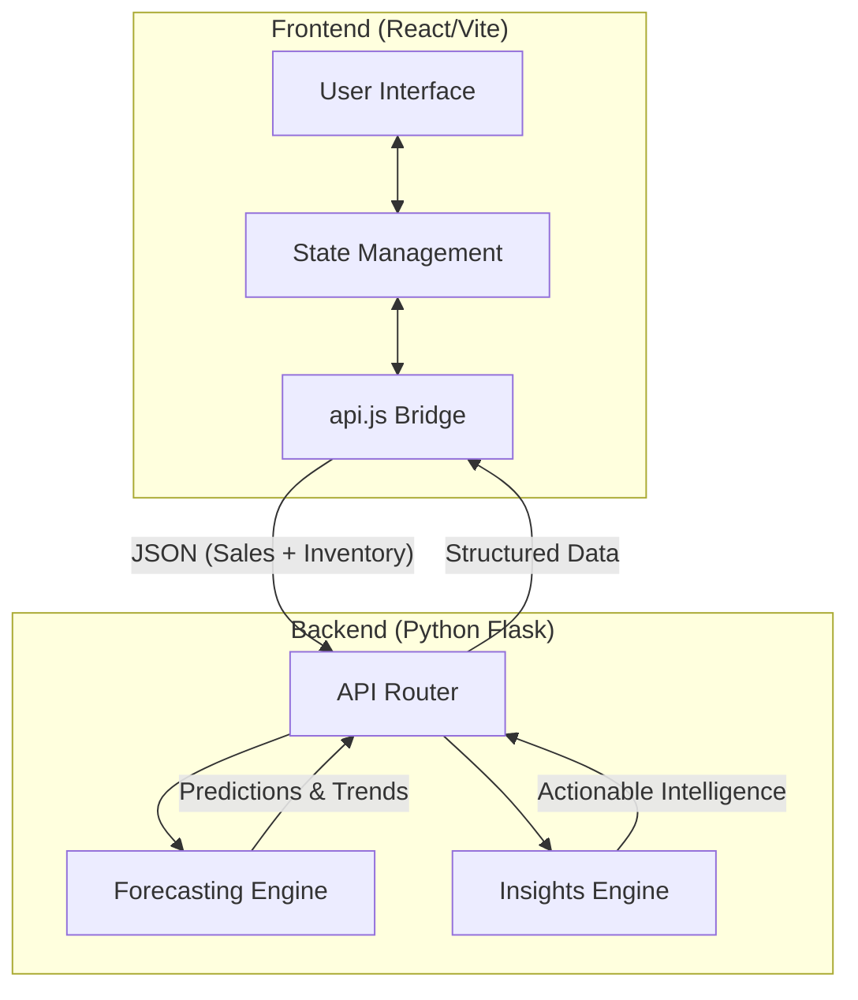
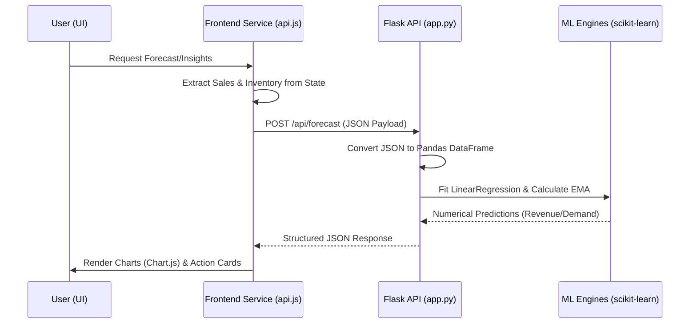
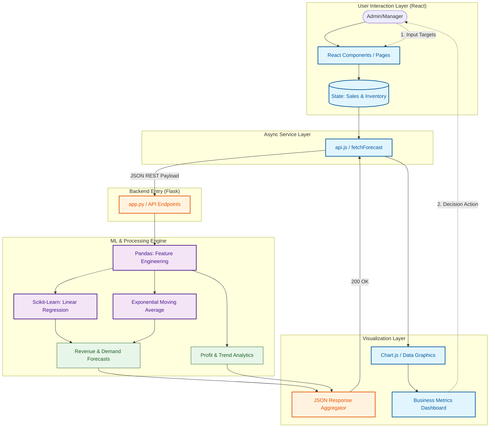

# CafeIQ - Cafeteria Management System Walkthrough

## Project Architecture

### 1. Data Entities Definition
To understand the workflow, we must first define the core data entities that drive the system:

*   **Sales Entity (Transaction Data):**
    *   **Source:** User input or historical logs.
    *   **Fields:** `date`, `itemId`, `itemName`, `category`, `quantity`, `costPerUnit`, `totalRevenue`.
    *   **Purpose:** The primary fuel for the ML Forecasting models. It represents "what happened" in the past.
*   **Inventory Entity (Asset Data):**
    *   **Source:** Current warehouse/kitchen stock levels.
    *   **Fields:** `id`, `name`, `category`, `currentStock`, `reorderLevel`, `maxStock`.
    *   **Purpose:** Combined with Sales projections to generate "Restocking Alerts" and "Overstock Warnings."

### 2. High-Level System Architecture


### 3. Detailed Data Flow & Workflow


### 4. System Logic Flowchart (Step-by-Step)
This diagram explains the internal logic used by the Python engines to generate the final results shown to the user.

```mermaid
graph TD
    %% Start
    Start([User opens Dashboard/Forecasting]) --> Get_Data[Gather Local Sales & Inventory Data]
    Get_Data --> Send_API[POST to Python Flask API /api/forecast]

    %% Backend Processing
    subgraph Backend_Intelligence [Backend: ML & Data Processing]
        Receive[API receives JSON Payload] --> DF[Convert to Pandas DataFrame]
        DF --> Split{Is it Forecast or Insights?}

        %% Forecasting Logic Branch
        Split -- "Forecasting" --> Month_Agg[Group Transactions by Month]
        Month_Agg --> Data_Check{Enough Data? <br/>n >= 3 Months}
        Data_Check -- "No" --> Error[Return 'Not Enough Data' Warning]
        Data_Check -- "Yes" --> LR[Train Scikit-Learn LinearRegression]
        LR --> Pred[Calculate Slope & Intercept]
        Pred --> EMA[Calculate 30-day EMA Trend]
        EMA --> Blend[Blend Models: 70% LR + 30% EMA]

        %% Insights Logic Branch
        Split -- "Insights" --> Window[Split into Recent 30d vs Previous 30d]
        Window --> Metric[Calculate Profit, Margin & % Growth]
        Metric --> Logic_Checks[Run Insight Logic Checks]
        Logic_Checks --> L1[Is Stock <= Reorder?]
        Logic_Checks --> L2[Is Growth > 5%?]
        Logic_Checks --> L3[Is Combo (Beverage+Meal) possible?]
    end

    %% Response
    Blend --> Pack[Package into Structured JSON Response]
    L1 & L2 & L3 --> Pack
    Pack --> Return[Send JSON back to Frontend]

    %% Frontend Rendering
    Return --> Render[Chart.js Renders Graphs]
    Render --> UI_Cards[Display AI Recommendation Cards]
    UI_Cards --> End([Manager takes business action])

    %% Styling
    style Backend_Intelligence fill:#f5faff,stroke:#005fb8,stroke-width:2px;
    style Data_Check fill:#fff4e5,stroke:#ed6c02;
    style Logic_Checks fill:#f3e5f5,stroke:#9c27b0;
    style Error fill:#ffebee,stroke:#d32f2f;
```

### 5. Master Full-Stack Project Flow
The following diagram provides a comprehensive view of the entire system's technology stack and data movement.



## ML Implementation (scikit-learn)

| Model | sklearn class | Use |
|-------|--------------|-----|
| Revenue Forecast | `LinearRegression` | Next month total revenue with confidence intervals |
| Spending Forecast | `LinearRegression` | Next month total cost |
| Item Demand | `LinearRegression` + `pandas.ewm()` | Per-item quantity (70% LR + 30% EMA blend) |
| Accuracy Metrics | `r2_score`, `mean_absolute_error` | R², MAE, MAPE via time-series cross-validation |
| Insights Engine | `pandas` groupby/agg | Trend detection, anomaly alerts, rankings, heatmaps |

## Key Changes in This Update

Previously: ML ran in-browser via `simple-statistics` (JavaScript)

Now: ML runs on a **Python Flask backend** using **scikit-learn** + **pandas**

### Files Created
| File | Purpose |
|------|---------|
| [app.py](file:///d:/Development/MiniProject/backend/app.py) | Flask server with `/api/forecast`, `/api/insights`, `/api/health` |
| [ml_models.py](file:///d:/Development/MiniProject/backend/ml_models.py) | [ForecastingEngine](file:///d:/Development/MiniProject/backend/ml_models.py#13-306) class using `sklearn.linear_model.LinearRegression` |
| [insights_engine.py](file:///d:/Development/MiniProject/backend/insights_engine.py) | [InsightsEngine](file:///d:/Development/MiniProject/backend/insights_engine.py#10-302) class using pandas |
| [requirements.txt](file:///d:/Development/MiniProject/backend/requirements.txt) | Python deps: flask, scikit-learn, pandas, numpy |
| [api.js](file:///d:/Development/MiniProject/src/services/api.js) | Frontend API service layer |

### Files Modified
- [Dashboard.jsx](file:///d:/Development/MiniProject/src/pages/Dashboard.jsx) — fetches insights from Python API
- [Forecasting.jsx](file:///d:/Development/MiniProject/src/pages/Forecasting.jsx) — fetches all predictions from Python API
- [Insights.jsx](file:///d:/Development/MiniProject/src/pages/Insights.jsx) — fetches recommendations/heatmap from Python API

### Files Deleted
- [src/ml/forecasting.js](file:///d:/Development/MiniProject/src/ml/forecasting.js) — replaced by [backend/ml_models.py](file:///d:/Development/MiniProject/backend/ml_models.py)
- [src/ml/insights.js](file:///d:/Development/MiniProject/src/ml/insights.js) — replaced by [backend/insights_engine.py](file:///d:/Development/MiniProject/backend/insights_engine.py)

## Verification Results

| Check | Result |
|-------|--------|
| React production build | ✅ 151 kB, 0 errors |
| Python ML imports | ✅ [ForecastingEngine](file:///d:/Development/MiniProject/backend/ml_models.py#13-306), [InsightsEngine](file:///d:/Development/MiniProject/backend/insights_engine.py#10-302) import OK |
| Flask server startup | ✅ Running on port 5000 |
| `/api/health` endpoint | ✅ `{"engine": "scikit-learn", "status": "ok"}` |

## How to Run

```bash
# Terminal 1: Python ML backend
cd backend
pip install -r requirements.txt
python app.py

# Terminal 2: React frontend
npm run dev
```
Open **http://localhost:5173/** — the app will auto-detect the Python backend and show a green "scikit-learn connected" banner.
